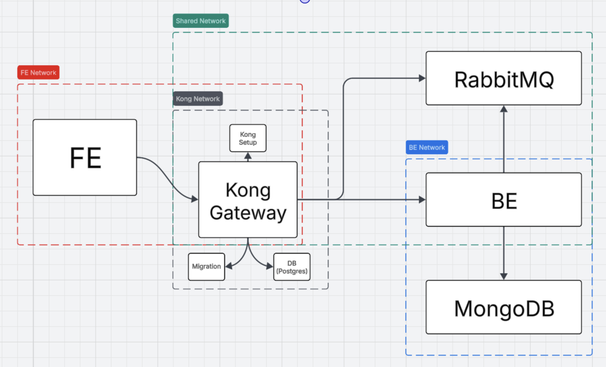

# ProgettoGiocattoloDMA

First "Toy Project" made in DMA for my internship

## Startup

With Docker Compose you just have to use this command:

```sh
docker compose up --build
```

Obviously you will need Docker installed on your device.

## Context

This project aims to simulate a full stack application with a level architecture back-end and a React front-end. Everything packed with Docker Compose

## Technology used

### Framework

- React: used for the front end.
- RabbitMQ: used as a mqtt broker.
- MongoDB: used to save messages shared with mqtt.
- Kong Gateway: used as a gateway.

### Libraries

- Mongoose: used for MongoDB interactions.
- Fastify: used for endpoints.
- Mqtt.js: used for RabbitMQ interactions.
- Zod: used for validate endpoint params.
- Eslint: used as a lint (you can use it with the command 'npx eslint .').

## Schema

Project architecture with all microservices and networks:

